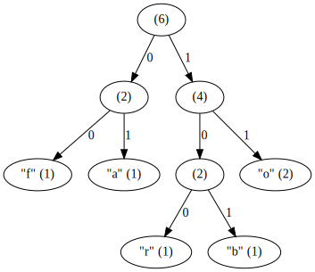
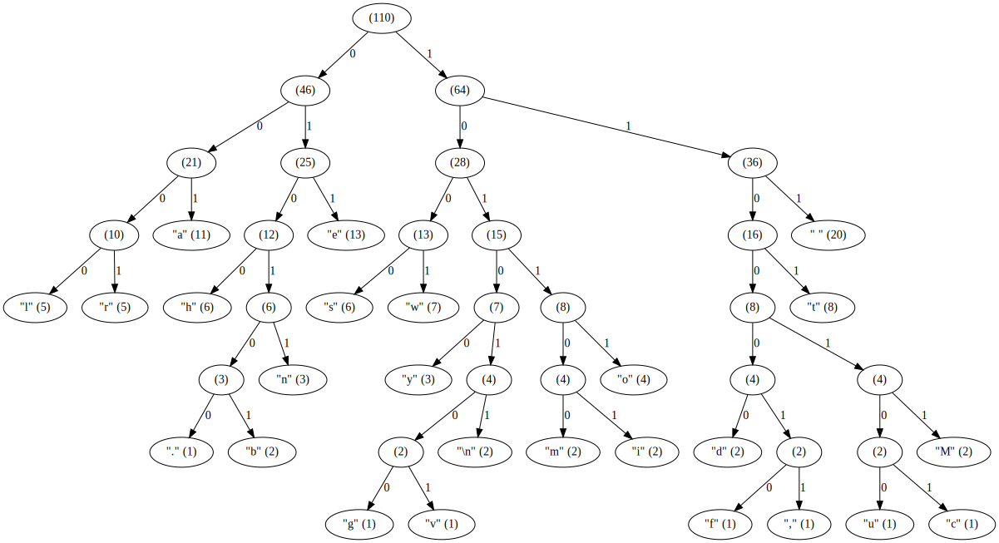

huffer
======
`huffer` is a data compression program that uses [Huffman coding][1].

It's a pretty bad data compression program.

```console
$ huffer --help
huffer - Huffman coding based data compression

usage:

  huffer --help
  huffer -h
    Print this message to standard output.

  huffer encode [--symbol-size=N] FILE
  huffer compress [--symbol-size=N] FILE
    Compress the specified FILE using a symbol size of N,
    or 1 by default. Print the compressed data to standard
    output.

  huffer decode [FILE]
  huffer decompress [FILE]
    Decompress the optionally specified FILE. Print the
    decompressed data to standard output. If FILE is not
    specified, then read from standard input.

  huffer graph [--symbol-size=N] [FILE]
    Create a Huffman tree of the specified FILE using
    a symbol size of N, or 1 by default. Print the graph to
    standard output in dot (Graphviz) format. If FILE is not
    specified, then read from standard input.
```
For example,

```console
$ printf 'foobar' >foobar.txt
$ huffer graph foobar.txt | dot -Tsvg
```



```console
$ >mary.txt cat <<'END'
Mary had a little lamb whose fleece was white as snow,
and everywhere that Mary went the lamb was sure to go.
END

$ huffer encode --symbol-size=2 mary.txt | huffer decode
Mary had a little lamb whose fleece was white as snow,
and everywhere that Mary went the lamb was sure to go.

$ huffer graph --symbol-size=1 mary.txt | dot -Tsvg
```



[1]: https://en.wikipedia.org/wiki/Huffman_coding
