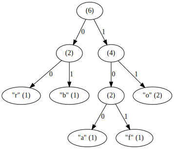
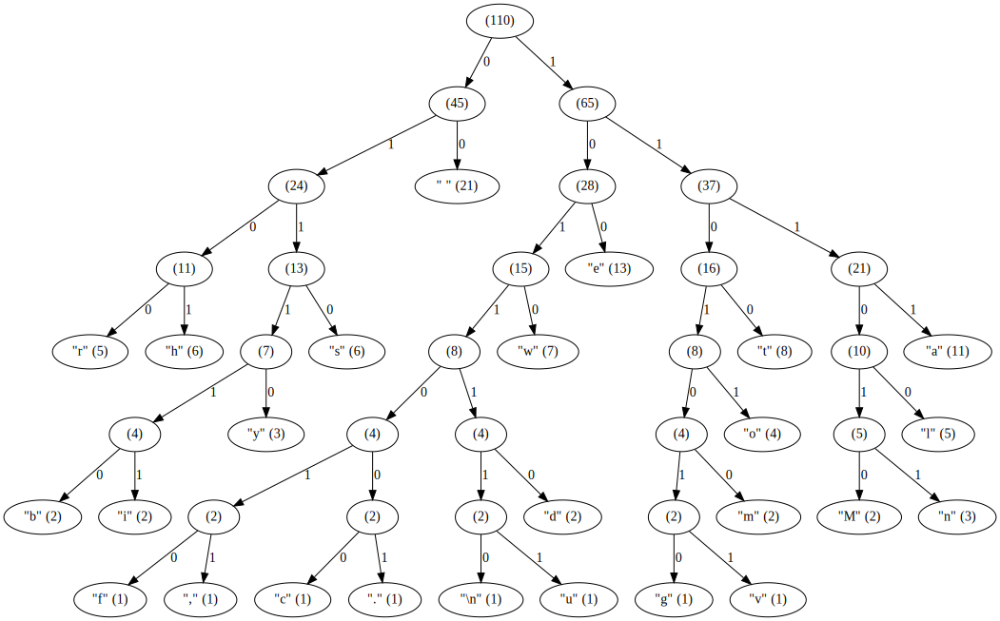

Huffman Trees
=============
`tree.cpp` is a program that creates a Huffman tree from standard input and
prints the tree as a graph to standard output.

For example,

> foobar

> Mary had a little lamb whose fleece was white as snow, and everywhere that
> Mary went the lamb was sure to go.

For more examples, see [examples/][1].

[1]: examples/
